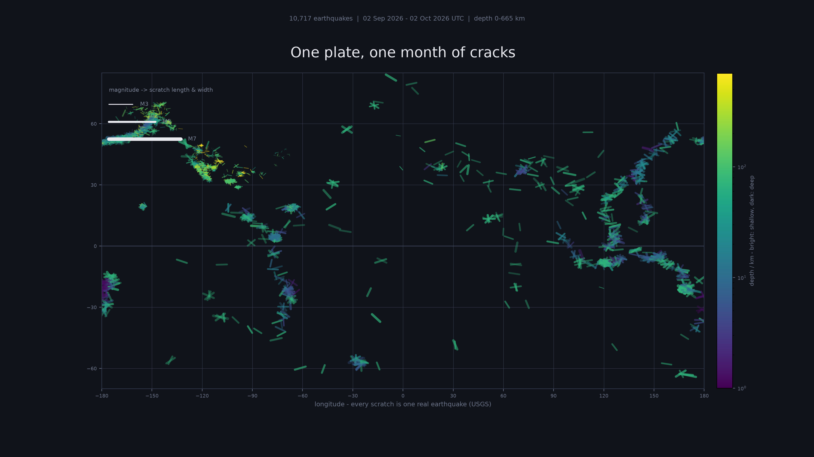

# quakes-this-month

One month of real earthquakes — every one of them a scratch on a plate.

## The phenomenon

Earthquakes are the sound of plates moving. The Earth's surface is a set of rigid plates that grind past one another, pull apart, and dive under at subduction zones; the places where they stick and then slip are where the ground shakes. Seismicity is constant — hundreds of events every day, most of them too small to feel — and it happens whether or not anyone is measuring it. I chose it because the pattern is the message: one month of data is enough for the plate boundaries to draw themselves, without a single coastline in the picture.

## The source

[USGS Earthquake Hazards Program — GeoJSON feeds](https://earthquake.usgs.gov/earthquakes/feed/v1.0/geojson.php), the "All earthquakes, past month" summary, fetched once on 2 October 2026.

The file is `data/all_month.geojson`: a GeoJSON `FeatureCollection` with **10,717 features**, exactly as it arrived from the server. Each feature is one earthquake: a location (longitude, latitude, depth in km), a time (milliseconds since 1970, UTC), and a magnitude (unitless, moment magnitude scale — a few events are negative, meaning very small slips). The feed is updated every minute; the committed version covers 02 Sep – 02 Oct 2026 UTC.

## The picture



Each of the 10,717 earthquakes is one scratch. Position is the epicentre's longitude and latitude; magnitude sets the scratch's length and width; depth sets the colour (bright = shallow, dark = deep); recency sets the brightness, so the newest cracks glow. The Pacific ring of fire, the mid-ocean ridges and the Himalayan collision zone all appear on their own.

What it hides: magnitude is compressed into length and width, depth is collapsed to a colour on a log scale, and time is folded into brightness — the sequence of an aftershock swarm, which events came first and which followed, is gone.

## How to run

```
uv run fetch.py
uv run plot.py
```

`fetch.py` needs the internet and is run once; everything after that reads `data/` and works with the wifi off.
